Homework7
================
Oohita Dasari

  - I have taken this dataset from `dslabs` datasets link
    “<https://rdrr.io/cran/dslabs/man/>”. From all the datasets in the
    link I choose the data of contagious diseases in US states from
    “<https://rdrr.io/cran/dslabs/man/us_contagious_diseases.html>”

  - Firstly, I installed package of “dslabs” by using the command
    `install.packages("dslabs")` and intalled dplyr , ggplot2 libraries.

  - In order to read the data I used `data(us_contagious_diseases)` and
    then view the data using `View(us_contagious_diseases)`.

<!-- end list -->

``` r
data(us_contagious_diseases)

?us_contagious_diseases
```

    ## starting httpd help server ... done

``` r
View(us_contagious_diseases)

str(us_contagious_diseases)
```

    ## 'data.frame':    18870 obs. of  6 variables:
    ##  $ disease        : Factor w/ 7 levels "Hepatitis A",..: 1 1 1 1 1 1 1 1 1 1 ...
    ##  $ state          : Factor w/ 51 levels "Alabama","Alaska",..: 1 1 1 1 1 1 1 1 1 1 ...
    ##  $ year           : num  1966 1967 1968 1969 1970 ...
    ##  $ weeks_reporting: int  50 49 52 49 51 51 45 45 45 46 ...
    ##  $ count          : num  321 291 314 380 413 378 342 467 244 286 ...
    ##  $ population     : num  3345787 3364130 3386068 3412450 3444165 ...

  - The dataset contains six attributes namely “disease”,“state”, “year”
    , “weeks\_reporting”,“count”, “population”. `Year` is a date
    attribute, `disease` and `state` belong to categorical attribute.
    `weeks_reporting`,`count` and `population` belong to quantative
    attribute.

  - The `disease` attribute contains details of 7 types of diseases that
    are spread throught the US states. `state` attribute provides
    detaild of the particular state the disease is reported. `year`
    attribute gives the details of the year in which the disease is
    reported. `weeks_reporting` has the information of number of weeks
    that the count of diseased people is reported in that state. `count`
    attribute shows the number of people affected with that patricular
    disease in that particular year. `population` has the details of the
    total population of that state during that particular year.

# Exploratory Data Analysis

**Question1 : What is the dataset saying?**

  - Initially I wanted to visualize the data to understand the data and
    notice the trends.
  - I created a plot of the in order to look for the distribution of the
    count of people affected by the 7 types of diseases in each US
    state.
  - I choosed a stacked bar chart for this visualization which groups
    the data of particular state and shows the variation with respect to
    diseases.

<!-- end list -->

``` r
gg<-ggplot(us_contagious_diseases, aes(state, count))
gg + geom_bar(position = "stack", stat = "identity",aes(fill = disease))+
  scale_fill_brewer(palette = "Set1")+ 
  ggtitle("Overall count of diseased people in each state of US,all years")+ 
  theme(axis.text.x = element_text(angle = 90))
```

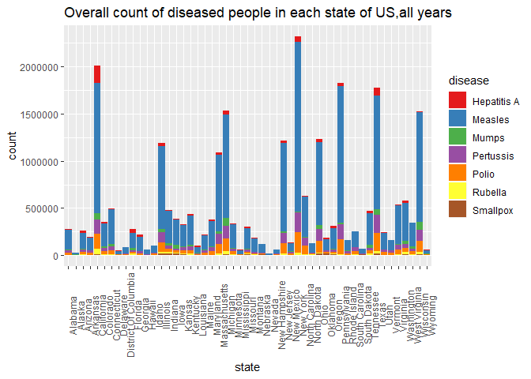<!-- -->

  - From the plot generated I can notice that approximately 80% of the
    states (42 states) has their count of people effected by the
    diseases less than `1000000(1 million)` people.
  - Only 20% on the US states(10 states) have their count of people
    effected by the diseases more than 1 million. From which we can
    clearly understand that the disease rate is high in that 10 states.

-----

**Question 2 :What is the trend of diseases through years?**

  - Now I wanted to visualize the rate of people affected by each
    variety of disease.
  - I grouped the data with similar years and similar diseases. Then I
    calculated the ratio of sum of count to sum of population and
    multipied with 10000 in order to calculate the rate at which the
    people are effected by the disease.

<!-- end list -->

``` r
  us_contagious_diseases %>%
  group_by(year, disease) %>%
  summarize(rate = sum(count)/sum(population)*10000) %>%
  ggplot(aes(year, rate, color = disease)) +
  geom_line()+ ggtitle("Yearly analysis of Rate of people affected by all diseases (considering NA values)")
```

    ## Warning: Removed 102 rows containing missing values (geom_path).

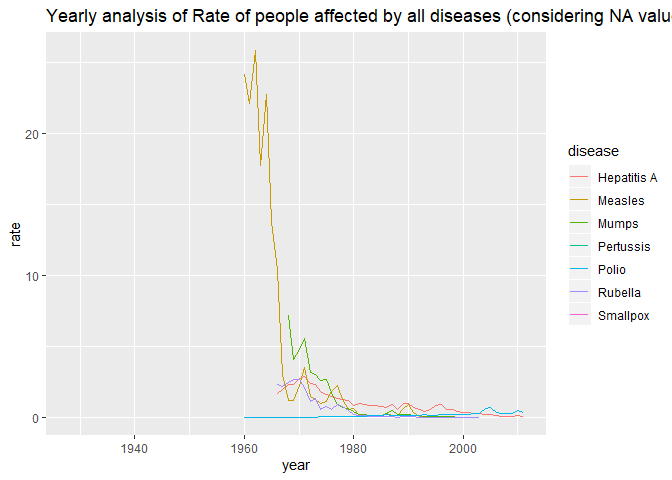<!-- -->

  - From the above graph it can be observed that there is no trend
    before the year 1960, this might be because there are many NA values
    or zeros for the data during those years. Due to which, the graph
    couldn’t plot the values for the rate because of the missing data in
    the population and count attributes as we used them for caluclating
    the rate.

**Question 3 : What if NA values are excluded?** \* From the previous
visualization, I found that the graph is inappropriate due to the NA
values. Now, I wanted to exclude the NA values in order to visualize the
trends. \* I used “filter(\!is.na(population))” to exck=lude the NA
values in the data.

``` r
us_contagious_diseases %>%
  filter(!is.na(population)) %>%
  group_by(year, disease) %>%
  summarize(rate = sum(count)/sum(population)*10000) %>%
  ggplot(aes(year, rate, color = disease)) +
  geom_line()+ ggtitle("Yearly analysis of Rate of people affected by all diseases (excluding NA values)")
```

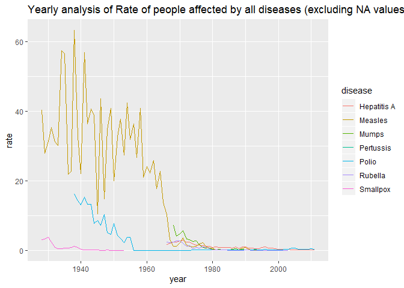<!-- -->

  - It can be observed that after removing the NA values, the trend is
    clearly visible for the years before 1960 as well.
  - So from the plot, we can see that the rate of people affected by
    measels is very high followed by rate of people affected by polio
    when compared to allother diseases.
  - It can aso be noticed that, the rate of people affected by the
    diseases are gradually reduced with years after 1960 and reduced to
    minimum from the year 1980 onwards.

# Detailed Questions generated from EDA

**Question 4: How are the trends of diseases in states where the overall
population affected by diseases is greater than 17.5 millio?**

  - From the first visualization I found that the highest count of
    diseased population above 17.5 million is found in four states
    (Arkansas, New mexico, Pennsylvania, tennessee)

  - So I want to visualize the trends of how the rate of population
    affected by diseases varied through years, for which I filtered the
    data of states.
    
    ***Plot for Arkansas:***
    
      - I used filter to get a subset of data for Arkansas and grouped
        the data of similar years and diseases. Now, I plotted line
        chart to observe the trend of people affected by various
        diseases in that
state.

<!-- end list -->

``` r
  us_contagious_diseases %>% filter(state=="Arkansas", !is.na(population)) %>% 
  group_by(year, disease) %>%
  summarize(rate = sum(count)/sum(population)*10000) %>%
  ggplot(aes(year, rate, color = disease)) + 
  ggtitle("Trend of diseases in Arkansas through years")+
  geom_line()
```

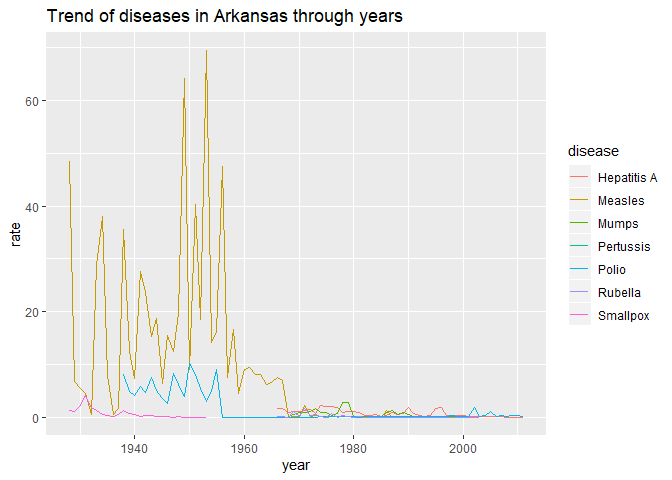<!-- -->

  - As it is observed that the rate of people effected by the diseases
    is decreasing to minimum after the year 1970, I’m concentrating on
    the trends between the years 1950 and 1970.
  - In arkansas, the highest reported disease is `measles` with nearly
    70% of the population during the period of 1950 to 1955. Later the
    rate got decreased to 10% of the population which is a drastic
    change.
  - Smallpox is not reported ater the year 1953(approximately)
  - Polio had the highest rate of 10% during the year 1950 and then it
    is gradually decreased to minimum value from around 1956.
  - Diseases like Mumps, Rubella, Hepatitis A, Pertussis are seemed to
    be reported from the year 1968 onwards. However,they are reported
    with minimum count of people.

***Plot for New Mexico:***

  - I used filter to get a subset of data for New Mexico and grouped the
    data of similar years and diseases. Now, I plotted line chart to
    observe the trend of people affected by various diseases in that
    state.

<!-- end list -->

``` r
  us_contagious_diseases %>% filter(state=="New Mexico", !is.na(population)) %>% 
  group_by(year, disease) %>%
  summarize(rate = sum(count)/sum(population)*10000) %>%
  ggplot(aes(year, rate, color = disease)) + 
  ggtitle("Trend of diseases in New Mexico through years")+
  geom_line()
```

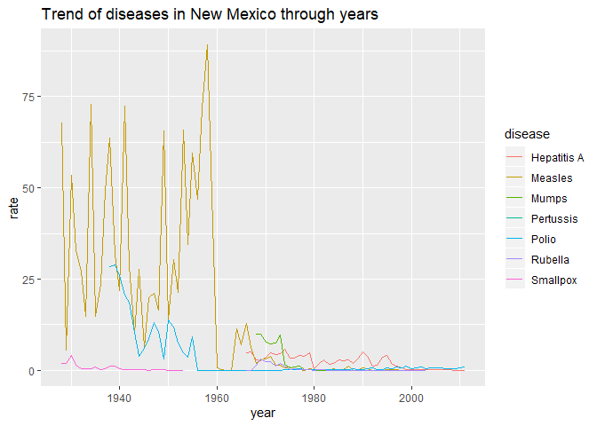<!-- -->

  - As it is observed that the rate of people effected by the diseases
    is decreasing to minimum after the year 1970.Therefore, I’m
    concentrating on the trends between the years 1950 and 1970.
  - In New Mexico, the highest reported disease is `measles` with nearly
    89% of the population during the period of 1955 to 1960. Later the
    rate got decreased to less than 3% of the population by the year
    1960. There is no count reported during the period 1962 to 1964
    which is unusual.Again,the rate of people effected by measles is
    minimised after 1967.
  - Smallpox is not reported ater the year 1953(approximately)
  - New Mexico has the highest rate of people effected with Polio as
    around 27.5% during the year 1938 which is greater than that
    reported in Arkansas and then it is gradually decreased to minimum
    value from around 1956.
  - Unlike Arkansas, Pertussis seems to be reported more in New mexico
    from 1968 to 1975. Diseases like Mumps, Rubella, Hepatitis A are
    seemed to be reported from the year 1968 onwards. However,they are
    reported with minimum count of people.

***Plot for Pennsylvania:***

  - I used filter to get a subset of data for Pennsylvania and grouped
    the data of similar years and diseases. Now, I plotted line chart to
    observe the trend of people affected by various diseases in that
    state.

<!-- end list -->

``` r
  us_contagious_diseases %>% filter(state=="Pennsylvania", !is.na(population)) %>% 
  group_by(year, disease) %>%
  summarize(rate = sum(count)/sum(population)*10000) %>%
  ggplot(aes(year, rate, color = disease)) + 
  ggtitle("Trend of diseases in Pennsylvania through years")+
  geom_line()
```

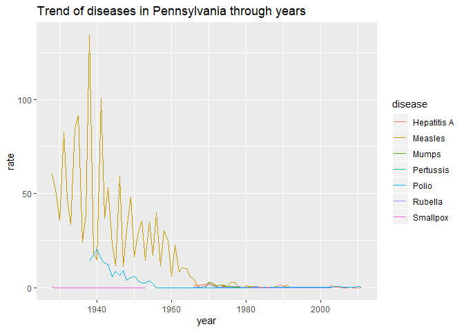<!-- -->

  - As it is observed that the rate of people effected by the diseases
    is decreasing to minimum after the year 1970.Therefore, I’m
    concentrating on the trends before the year 1970.
  - In Pennsylvania, the highest reported disease is `measles` with
    nearly 137% of the population during the period of 1935 to 1940.
    Later the rate got decreased to less than 25% of the population by
    the year 1960. Again,the rate of people effected by measles is
    minimised after 1967.
  - Smallpox is not reported ater the year 1953(approximately) and even
    for the years for which it is reported it has the least count
    reported.
  - Pennsylvania has the highest rate of people effected with Polio as
    around 23% during the year 1940 which is greater than that reported
    in Arkansas bus less than that of New Mexico and then it is
    gradually decreased to minimum value from around 1956.
  - Diseases like Mumps, Rubella, Hepatitis A, Pertussis are seemed to
    be reported from the year 1968 onwards. However,they are reported
    with minimum count of people.It seems that some diseases are not
    reported during few years.

***Plot for Tennessee:***

  - I used filter to get a subset of data for Tennessee and grouped the
    data of similar years and diseases. Now, I plotted line chart to
    observe the trend of people affected by various diseases in that
    state.

<!-- end list -->

``` r
   us_contagious_diseases %>% filter(state=="Tennessee", !is.na(population)) %>% 
  group_by(year, disease) %>%
  summarize(rate = sum(count)/sum(population)*10000) %>%
  ggplot(aes(year, rate, color = disease)) + 
  ggtitle("Trend of diseases in Tennessee through years")+
  geom_line()
```

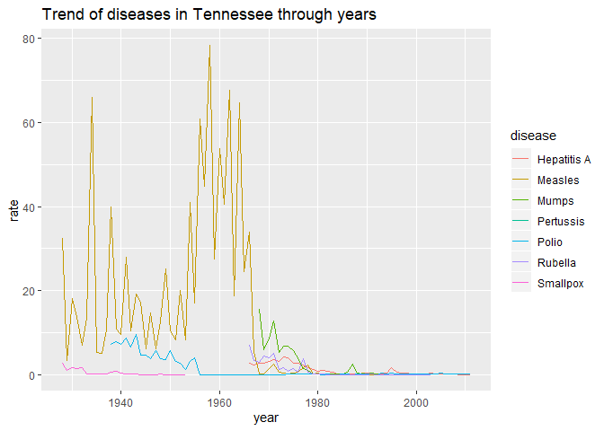<!-- -->

  - As it is observed that the rate of people effected by the diseases
    is decreasing to minimum after the year 1970.Therefore, I’m
    concentrating on the trends before the year 1970.

  - In Tennessee, the highest reported disease is `measles` with nearly
    78% of the population during the period of 1955 to 1960. Later the
    rate got decreased to less than 35% of the population by the year
    1966. Again,the rate of people effected by measles is minimised
    after 1968.

  - Smallpox is not reported ater the year 1953(approximately) .

  - The highest rate of people effected with Polio is around 10% during
    the year 1944 and then it is gradually decreased to minimum value
    from around 1956.

  - Pertussis seems to be reported in Tenessee at the rate od 16% which
    is more than what is reported in New Mexico. Diseases like Mumps,
    Rubella, Hepatitis A are seemed to be reported from the year 1968
    onwards. However,they are reported with minimum count of people.It
    seems that some diseases are not reported during few years.

  - From all the above plots it can be observed that Measles used to be
    a very common disease before 1960 in all the selected four states of
    US with highest count of people effected by it. However, it is also
    observed that they handled it effectively after 1960.

**Question 5 : Will weeks\_reporting attribute effect the
visualization?**

  - Now, As it is observed in the above graphs that there is some sudden
    drop in the trends and there is no trend during few years.
  - Therefore, I wanted to observe, If the weeks\_reporting attribute
    that describes the number of weeks in a particular year that the
    count of people effeted by a particular disease is reported has any
    influence of the trends.
  - I plotted the graphs for all the four states of US for which the
    highest rate of population effeted by diseases is observed.

***Plot for
Arkansas:***

``` r
  us_contagious_diseases %>% filter(state=="Arkansas" & weeks_reporting >= 10, !is.na(population)) %>% 
  group_by(year, disease) %>%
  summarize(rate = sum(count)/sum(population)*10000) %>%
  ggplot(aes(year, rate, color = disease)) + 
  ggtitle("Trend of diseases in Arkansas through years (considering weeks reporting)") +
  geom_line()
```

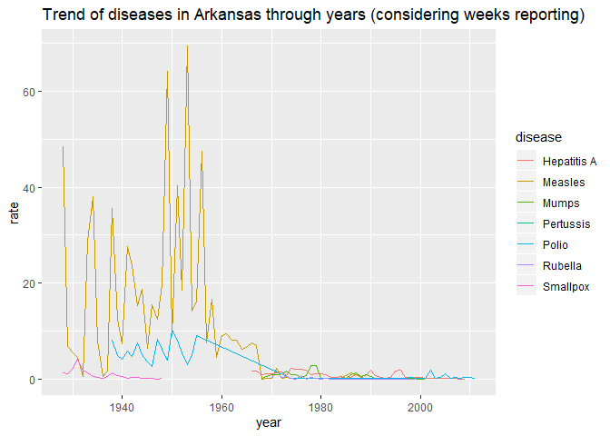<!-- -->

***Plot for New
Mexico:***

``` r
  us_contagious_diseases %>% filter(state=="New Mexico" & weeks_reporting >= 10, !is.na(population)) %>% 
  group_by(year, disease) %>%
  summarize(rate = sum(count)/sum(population)*10000) %>%
  ggplot(aes(year, rate, color = disease)) +
  ggtitle("Trend of diseases in New Mexico through years (considering weeks reporting)") +
  geom_line()
```

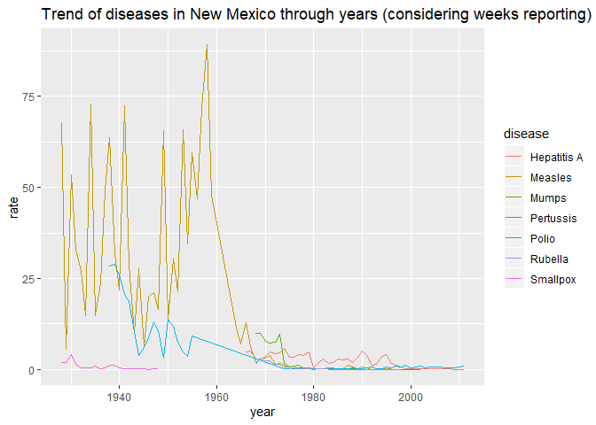<!-- -->

***Plot for
Pennsylvania:***

``` r
  us_contagious_diseases %>% filter(state=="Pennsylvania" & weeks_reporting >= 10, !is.na(population)) %>% 
  group_by(year, disease) %>%
  summarize(rate = sum(count)/sum(population)*10000) %>%
  ggplot(aes(year, rate, color = disease)) + 
  ggtitle("Trend of diseases in Pennsylvania through years (considering weeks reporting)") +
  geom_line()
```

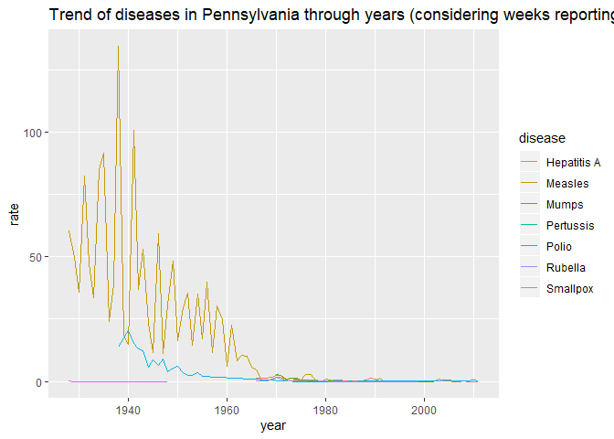<!-- -->

***Plot for
Tennessee:***

``` r
  us_contagious_diseases %>% filter(state=="Tennessee" & weeks_reporting >= 10, !is.na(population)) %>% 
  group_by(year, disease) %>%
  summarize(rate = sum(count)/sum(population)*10000) %>%
  ggplot(aes(year, rate, color = disease)) + 
  ggtitle("Trend of diseases in Tennessee through years (considering weeks reporting)") +
  geom_line()
```

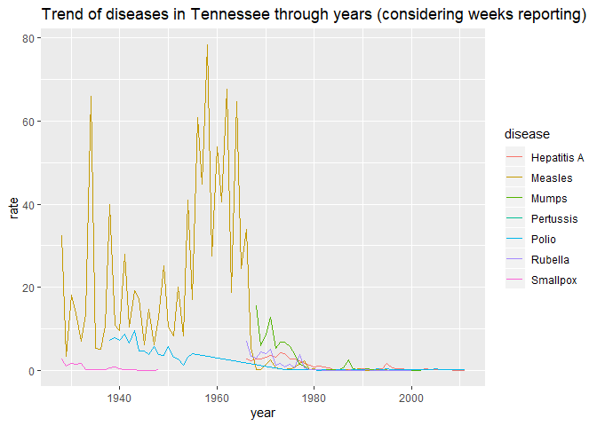<!-- -->

  - From the above plots, it can observed that there is not much impact
    of weeks\_reporting on the visualization. One observation can be
    noticed in the case of New Mexico data where we observed some
    missing data during the year 1960 to 1965. When weeks\_reporting
    less than 10 in a year are excluded it can be observed that the plot
    has connectivity.
