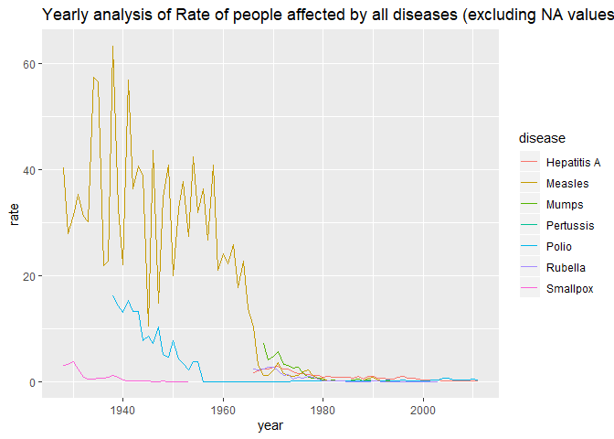
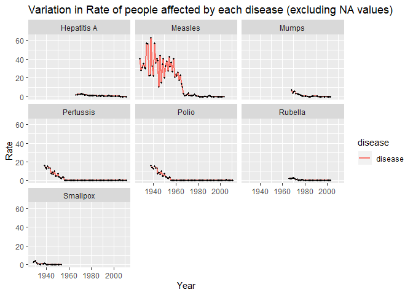

Homework8
================
Oohita Dasari

# Image of Draft chart from HW7

**Question 2 :What is the trend of diseases through years?** **Question
3 : What if NA values are excluded?**

  - From the previous visualization, I found that the graph is
    inappropriate due to the NA values. Now, I wanted to exclude the NA
    values in order to visualize the trends.
  - I used “filter(\!is.na(population))” to exck=lude the NA values in
    the data.

<!-- end list -->

``` r
us_contagious_diseases %>%
  filter(!is.na(population)) %>%
  group_by(year, disease) %>%
  summarize(rate = sum(count)/sum(population)*10000) %>%
  ggplot(aes(year, rate, color = disease)) +
  geom_line()+ ggtitle("Yearly analysis of Rate of people affected by all diseases (excluding NA values)")
```

<!-- -->

# Image of the refined chart

``` r
us_contagious_diseases %>% 
     filter(!is.na(population)) %>% 
     group_by(year, disease) %>%
     summarize(rate = sum(count)/sum(population)*10000) %>% 
     ggplot(aes(y=rate , x=year,color=disease))+geom_line(aes(color='disease'),size=1)+ geom_point(color="black",size=0.6)+
    facet_wrap('~disease', nrow=3, ncol=3)+ ggtitle( "Variation in Rate of people affected by each disease (excluding NA values)")+ labs(x = "Year")+labs(y="Rate")
```

<!-- -->

# Description of all design decisions made in transforming from the draft to the refined chart

  - From the suggestions given on HW7. I have added a question to my
    Question 3 to analyze the “impact of vaccines on the disease rates”
    from the graph analysing the variation in rate of people effected by
    each disease (excluding NA values).
  - I choose small multiples chart to answer this question because from
    the graph that I created in HW7 the distribution of Mumps, Rubella
    and Pertusis are not individually clear.
  - A small multiple graph for each disease will be helpful in order to
    make a clear analysis of rate of people affected by each disease.
  - I also choose to include points for every peak variation in order to
    make sure that any minute variations are clearly noticed.
  - Small multiples graph also makes it easier to compare the several
    attributes without any visual disturbances when compared to the line
    graph in HW7.
  - On the purpose of differentiation, I choose the line representing
    disease in Red color and the point indicating the variation in black
    color.
  - I changed the title of the chart as “Variation in rate of people
    effected by each disease(excluring NA values)” to highlight that i’m
    showing the variation for each disease
seperately.

# Explanation of how your final chart answers the question you asked in HW7 and how your headline fits your chart

  - I have choosen my Question 3 (as advised) to improve the chart in
    such a way that it shows an analysis in a detailed way like a story
    describing how the invention of vaccines effects the rate of people
    effceted by the diseases varies.
  - I wanted to make an analysis of the variation in rate of people
    effected by a particular disease with respect to the year in which
    the vaccine of that didease is introduced.

**Hepatitis A**

  - Vaccine for Hepatitis A wa introduced in the year 1980 and a
    recombined version of the vaccine was introduced into the market in
    1986.
  - From the graph it can be observed that the rate of people effected
    by Hepatitis A was arount 2 million and it got decreased to a range
    of half million to one million from 1980 onwards.

**Measles**

  - Unlike other diseases, it can be clearly observed that Measles is a
    widely spread didease in the US. Vaccine for measles was introduced
    in 1963 and a combined version of vaccine for Measles Mumps and
    Rubella is introduced in 1971.
  - From the graph it can be observed that the rate of people effected
    by Measles in 1966 was around 25 million and then the count started
    decreasing. It dropped approximately to a range of 3 to 4 million by
    the year 1968. Later after 1971 it has decreased to less that one
    million.

**Mumps**

  - Vaccine for Mumps was introduced in 1967. It can be depicted from
    the graph that in 1967 the rate of people effected by Mumps is
    around 8 million. And then with the development of vaccine the rate
    of people being effected is slowly decreased to one million within a
    period of 10 years approximately.
  - The vaccine was recommended for the routine use in the US from the
    year 1977 from when it can be observed that the rate of people being
    effected by Mumps as become minimum and has never rised.

**Pertussis**

  - The vaccine came into use in 1940’s. From the graph it can be seen
    that the rate of people effected by pertussis has decreased when
    compared to that in 1930’s.  
  - later it can be seen there is a slight increase in the rate of
    people effcted but then it gradually decreased from 1942 and got to
    minimum by 1955.

**Polio**

  - The vaccine for polio was introduced in the year 1955.
  - It can be seen that the rate of people effected by Polio has dropped
    to minimum from 1957 onwards.

**Rubella**

  - Vaccine for Rubella was introduce in 1969 and we can see that the
    rate of people effected by Rubella started dropping form aroung 2
    million to the minimun by the year 1980

**Small Pox**

\*It can be observed that small pox has been eradicated during the
decade 1950’s. The vaccine was introduced in 1796 according to the
records. From the data we have in the data set it can be seen that the
invention of vaccine was helpful in successfully eradicating the
disease.

**From the above analysis it is clear that , the invention of vaccines
has contributed very much for decreasing the rate of people effected by
that disease**.

# References:

  - Stack overflow
  - Kaggle
  - Google for checking the years in which the vaccines were introduced
